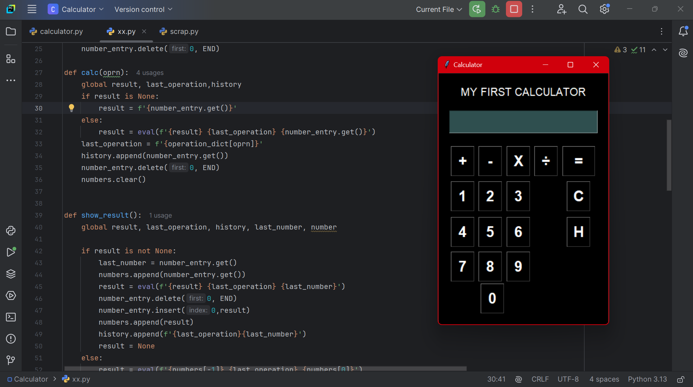

# 🧮 My First Calculator in Python (Tkinter)

> _"This calculator was built with curiosity, doubt, persistence, and joy — my first proud GUI project."_

---

## 📸 Screenshot

<!-- Paste your screenshot in this repo and link it here -->

---

## 🚀 Features

- Built using Python's `tkinter` library.
- Clean, intuitive calculator GUI.
- Supports basic arithmetic operations: ➕ ➖ ✖️ ➗
- Pressing operation buttons repeatedly **chains operations** based on the last two inputs.
  - For example: `5 + + +` keeps adding 5 — implemented **naively but proudly** 💪

---

## 🧠 What I Learned

- How to design a user interface using `tkinter`.
- How to manage **state** and **events** in a GUI application.
- Debugging layout & logic issues in real-time.
- Most importantly — that **I can build real applications** from scratch.

---

